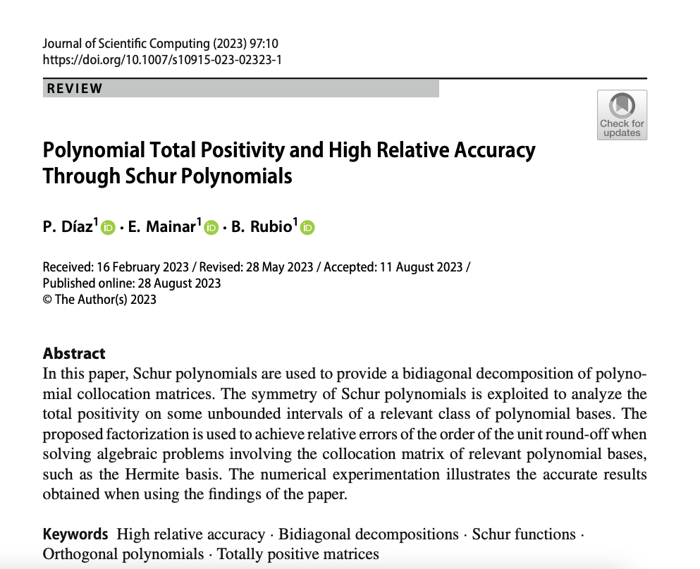

# Polynomial Total Positivity and High Relative Accuracy Through Schur Polynomials

In [BD_Polynomial_bases](https://github.com/BeatrizRubio/Article_JSC_2023/tree/main/Polynomial_bases_Schur) Schur polynomials are used to provide a bidiagonal decomposition of polynomial collocation matrices (see Theorem 3 of [1]).  Using these bidiagonal decomposition and the functions available in  http://math.mit.edu/~plamen/software/TNTool.html, we also provide methods for solving to high relative accuracy  different problems of Numerical Linear Algrebra with several known polynomial bases (see Sections 5  and 6 of [1]). The implementation uses Matlab 2022b.

[1] Díaz, P., Mainar, E., Rubio, B. Polynomial Total Positivity and High Relative Accuracy Through Schur Polynomials. J Sci Comput 97, 10 (2023). https://doi.org/10.1007/s10915-023-02323-1

